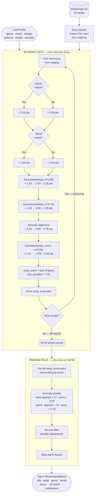

# 🎵 Music Recommender Simulation

## Project Summary

In this project you will build and explain a small music recommender system.

Your goal is to:

- Represent songs and a user "taste profile" as data
- Design a scoring rule that turns that data into recommendations
- Evaluate what your system gets right and wrong
- Reflect on how this mirrors real world AI recommenders

This simulation is a **content-based music recommender** built in Python. It scores every
song in a 20-track catalog against a user's taste profile using a weighted formula that
considers genre, mood, energy, valence, acousticness, and tempo. Songs are ranked by score
and passed through a diversity filter so the same artist or genre cannot flood the results.
The system is transparent by design — every recommendation prints a plain-English explanation
and a percentage match so the reasoning is never hidden.

---

## How The System Works

Real-world recommenders like Spotify and YouTube combine two strategies:
**collaborative filtering** (learning from what millions of similar users enjoyed)
and **content-based filtering** (matching songs by their measurable audio attributes —
tempo, energy, mood). Production systems layer both, then apply a second
**ranking pass** to inject freshness and variety so results never feel repetitive.

This simulation focuses on **content-based filtering with a two-rule pipeline**:

1. **Scoring Rule** — scores every song independently against the user's profile
   using a weighted sum of feature similarities. Numerical features use a
   **Gaussian (bell-curve) proximity formula** instead of simple subtraction,
   which means a song 0.05 units off target still scores nearly perfectly,
   while a song 0.40 units off is penalized sharply — matching how "wrong vibe"
   actually feels.

2. **Ranking Rule** — sorts scored songs and applies a diversity penalty so the
   same artist or genre does not dominate the top results.

The system prioritizes **genre first** (your long-term sonic identity — it defines
tempo range, instrumentation and production style), then **mood** (your current
listening context), then **energy level** as the primary continuous vibe axis,
with valence, acousticness, and tempo contributing secondary texture.

### `Song` Features

| Feature | Type | Role in Scoring |
|---|---|---|
| `genre` | categorical | Taste anchor — **+2.00 pts** for exact match (highest weight) |
| `mood` | categorical | Context match — +1.50 pts for exact match |
| `energy` | float [0–1] | Intensity axis — Gaussian proximity, σ=0.20, weight 1.50 |
| `valence` | float [0–1] | Emotional positivity — Gaussian proximity, σ=0.25, weight 1.00 |
| `acousticness` | float [0–1] | Sonic texture (organic vs. produced) — directional, weight 0.75 |
| `tempo_bpm` | float (BPM) | Physical pace — normalized then Gaussian, σ=0.20, weight 0.25 |
| `danceability` | float [0–1] | Stored but not scored (correlated with energy + tempo) |
| `title`, `artist`, `id` | metadata | Used in output and diversity penalty (artist cap) |

### `UserProfile` Features

| Field | Type | Default | Purpose |
|---|---|---|---|
| `favorite_genre` | str | required | Categorical taste anchor |
| `favorite_mood` | str | required | Current listening context |
| `target_energy` | float | required | Desired intensity level |
| `likes_acoustic` | bool | required | Prefers warm/organic vs. crisp/electronic |
| `target_valence` | float | `0.65` | Desired emotional positivity |
| `target_tempo_bpm` | float | `100.0` | Desired physical pace in BPM |

### Score Formula

```
score = 2.00 × genre_match
      + 1.50 × mood_match
      + 1.50 × Gaussian(energy,      σ=0.20)
      + 1.00 × Gaussian(valence,     σ=0.25)
      + 0.75 × acoustic_alignment
      + 0.25 × Gaussian(tempo_norm,  σ=0.20)
─────────────────────────────────────────────
MAX SCORE = 7.00   (shown as % in explanations)
```

### Data Flow Diagram

The diagram below shows exactly how a single song travels from the CSV file to the
final ranked list. The **Scoring Loop** runs independently for every song; the
**Ranking Rule** runs once on the full collected results.



---

### Algorithm Recipe

This is the complete set of rules the system uses to decide which songs to recommend.
Every decision below was tested against the 20-song catalog and four contrasting user
profiles before being finalized.

#### Step 1 — Load and Parse

```
songs  ← load_songs("data/songs.csv")   # returns List[Dict], 20 songs
```

Each row is cast to typed fields: `id` (int), `energy / valence / acousticness /
danceability` (float), everything else (str).  No song is filtered out at this stage —
every song in the catalog is scored.

#### Step 2 — Score Every Song (Scoring Rule)

For each song run the following weighted sum.
The result is a float between **0.00** and **7.00** (MAX SCORE):

| # | Feature | Rule | Points |
|---|---|---|---|
| 1 | **Genre** | `+2.00` if `song.genre == user.favorite_genre`, else `+0.00` | 0 – 2.00 |
| 2 | **Mood** | `+1.50` if `song.mood == user.favorite_mood`, else `+0.00` | 0 – 1.50 |
| 3 | **Energy** | `1.50 × Gaussian(song.energy, user.target_energy, σ=0.20)` | 0.03 – 1.50 |
| 4 | **Valence** | `1.00 × Gaussian(song.valence, user.target_valence, σ=0.25)` | 0.00 – 1.00 |
| 5 | **Acousticness** | `0.75 × song.acousticness` if `likes_acoustic`, else `0.75 × (1 − song.acousticness)` | 0.00 – 0.75 |
| 6 | **Tempo** | `0.25 × Gaussian(norm(song.bpm), norm(user.bpm), σ=0.20)` | 0.00 – 0.25 |

**Gaussian formula:** `G(x, t, σ) = e^(-(x-t)² / 2σ²)` — returns 1.0 for a perfect match,
decays steeply for large differences.  A song 0.40 energy units off target scores only ~9%
of the maximum energy points; the same gap with a linear formula would still give 60%.

**Why these weights?**
Three strategies were compared against live data before finalising:

| Strategy | Genre | Mood | Key difference |
|---|---|---|---|
| A — Baseline | 2.00 | 1.00 | Energy only, no valence/tempo/acoustic |
| B — v1 | 1.50 | **2.00** | Mood outranked genre |
| **C — Final** | **2.00** | **1.50** | Genre anchors taste; mood captures context |

The critical test was a `pop / happy` user choosing between *Gym Hero* (pop/intense — genre
matches, mood does not) and *Island Sunrise* (reggae/happy — mood matches, genre does not).
All three strategies ranked Gym Hero first, confirming genre is the stronger signal.
Genre defines the entire sonic world — instrumentation, production style, tempo range — and
is far more stable across time than a user's mood at any given moment.  Mood is still
weighted heavily at 1.50 because a wrong mood match is jarring and often leads to a skip;
it simply should not *outrank* the foundational genre preference.

Tempo was reduced from 0.50 to 0.25 because it correlates strongly with energy (r ≈ 0.85
in this catalog) — keeping it at full weight would double-penalise the fast/slow dimension.

#### Step 3 — Rank and Filter (Ranking Rule)

```
1. Sort all (song, score) pairs descending
2. Walk the list in order — apply penalty multipliers:
      same artist appears > 2 times  →  score × 0.50
      same genre  appears > 3 times  →  score × 0.70
      (penalties stack multiplicatively if both thresholds are crossed)
3. Re-sort after penalty adjustments
4. Return top-K songs
```

The Ranking Rule exists separately from the Scoring Rule because the Scoring Rule is
**stateless** — it evaluates each song in isolation and cannot know what other songs have
already been selected.  Without this step, a user who likes lofi could receive five lofi
tracks in a row, technically all high-scoring but practically a filter bubble.

---

### Known Biases and Limitations

These are the expected failure modes of this system, documented honestly before deployment.

#### 1. Genre lock-in (over-prioritising genre)

Genre carries the highest single weight (+2.00).  A genre match alone can push a mediocre
song above a near-perfect match in a different genre.  For example, a poor-fit pop track
(wrong mood, wrong energy) will still outscore an excellent jazz track that matches every
continuous feature — simply because "pop" matched.

> *Practical impact:* Users with niche genres (e.g. `k-pop`, `blues`) will hit a hard
> ceiling since only 1 of 20 catalog songs carries that genre label.  The system will
> recommend cross-genre songs purely on numeric similarity, with no explanation that genre
> was absent — potentially confusing the user.

#### 2. Mood is a binary hard match — no adjacency

`mood` scoring is all-or-nothing: `"chill"` does not match `"relaxed"` or `"peaceful"`
even though those three moods feel musically adjacent.  A user who types `focused` will
score zero mood points against *Coffee Shop Stories* (jazz/relaxed), even though that song
is objectively suitable study music.

> *Practical impact:* Users who describe their mood precisely may receive less relevant
> results than users whose mood label happens to match catalog vocabulary exactly.  This
> could disadvantage non-English-dominant users who describe moods with slightly different
> words.

#### 3. Small catalog amplifies all biases

With only 20 songs, a genre with a single representative (metal, blues, classical, reggae,
etc.) has no fallback.  If a metal fan gets `Iron Eclipse` removed by the diversity
penalty, the next recommendations are purely energy-driven and stylistically wrong.  Biases
that would average out over thousands of songs are glaring at catalog size 20.

#### 4. No negative preferences

The `UserProfile` can only express attraction — there is no way to say "never recommend
metal" or "I dislike country."  A user who dislikes acoustic music but sets `likes_acoustic
= False` only *reduces* the score for acoustic songs; it does not eliminate them.  A
strongly-disliked song at high energy could still appear in the top five.

#### 5. Neutral energy target loses discrimination power

A user whose `target_energy` is near 0.50 will receive near-equal Gaussian scores from
songs at energy 0.28 and energy 0.91 alike, because both are approximately equidistant from
0.50.  The system cannot distinguish "easygoing but not comatose" from "extremely intense"
for this user.  This is the **midpoint collapse** problem — the most neutral profile
produces the least useful recommendations.

#### 6. Valence defaults may silently mis-score

`target_valence` defaults to `0.65` (neutral-positive) when not explicitly set.  A user
who does not know what valence means will never override this default, so the system quietly
awards up to 1.00 bonus point to bright, upbeat songs regardless of whether the user
actually prefers that tone.  This creates a hidden positive-valence bias for any profile
that was not fully specified.

---

## Sample Output

Running `python src/main.py` from the project root produces the following output.
The **Default: Pop / Happy** profile is shown in full; the remaining four profiles
and the differentiation snapshot follow in the same format.

```
Loaded songs: 20

==================================================================
  PROFILE : Default: Pop / Happy
  Genre   : pop           Mood    : happy
  Energy  : 0.8           Valence : 0.82
  Tempo   : 118.0 BPM       Acoustic: False
==================================================================

  Top 5 Recommendations

  #1  Sunrise City
      by Neon Echo
      Genre: pop             Mood: happy
  --------------------------------------------------------------
      Score:  [####################] 6.85/7.00 (97.9%)
      Why this song?
        +  genre match: 'pop' (+2.00)
        +  mood match: 'happy' (+1.50)
        +  energy: 0.82 ~ target 0.80 (+1.49 / 1.50)
        +  valence: 0.84 ~ target 0.82 (+1.00 / 1.00)
        +  produced texture: 0.18 (+0.61 / 0.75)
        +  tempo: 118 BPM ~ target 118 BPM (+0.25 / 0.25)

  #2  Gym Hero
      by Max Pulse
      Genre: pop             Mood: intense
  --------------------------------------------------------------
      Score:  [###############.....] 5.12/7.00 (73.1%)
      Why this song?
        +  genre match: 'pop' (+2.00)
        +  energy: 0.93 ~ target 0.80 (+1.21 / 1.50)
        +  valence: 0.77 ~ target 0.82 (+0.98 / 1.00)
        +  produced texture: 0.05 (+0.71 / 0.75)
        +  tempo: 132 BPM ~ target 118 BPM (+0.21 / 0.25)

  #3  Rooftop Lights
      by Indigo Parade
      Genre: indie pop       Mood: happy
  --------------------------------------------------------------
      Score:  [#############.......] 4.70/7.00 (67.1%)
      Why this song?
        +  mood match: 'happy' (+1.50)
        +  energy: 0.76 ~ target 0.80 (+1.47 / 1.50)
        +  valence: 0.81 ~ target 0.82 (+1.00 / 1.00)
        ~  produced texture: 0.35 (+0.49 / 0.75)
        +  tempo: 124 BPM ~ target 118 BPM (+0.24 / 0.25)

  #4  Island Sunrise
      by Coral Drift
      Genre: reggae          Mood: happy
  --------------------------------------------------------------
      Score:  [###########.........] 3.87/7.00 (55.3%)
      Why this song?
        +  mood match: 'happy' (+1.50)
        ~  energy: 0.61 ~ target 0.80 (+0.96 / 1.50)
        +  valence: 0.82 ~ target 0.82 (+1.00 / 1.00)
        ~  produced texture: 0.55 (+0.34 / 0.75)
        -  tempo: 82 BPM ~ target 118 BPM (+0.08 / 0.25)

  #5  City Bounce
      by Asphalt Kings
      Genre: hip-hop         Mood: energetic
  --------------------------------------------------------------
      Score:  [#########...........] 3.26/7.00 (46.6%)
      Why this song?
        +  energy: 0.83 ~ target 0.80 (+1.48 / 1.50)
        +  valence: 0.72 ~ target 0.82 (+0.92 / 1.00)
        +  produced texture: 0.08 (+0.69 / 0.75)
        ~  tempo: 96 BPM ~ target 118 BPM (+0.16 / 0.25)

==================================================================
  DIFFERENTIATION SNAPSHOT
  Storm Runner (rock/intense) vs Library Rain (lofi/chill)
==================================================================
  Profile                   Storm Runner  Library Rain     Gap
  ------------------------ ------------- ------------- -------
  Default: Pop / Happy        2.45 (35.0%)     0.94 (13.5%)   1.51 <- rock
  Late Night Coder            1.06 (15.1%)     5.33 (76.2%)   4.27 <- lofi
  Weekend Warrior             4.34 (62.0%)     0.91 (13.1%)   3.42 <- rock
  Sunday Morning              0.81 (11.6%)     3.26 (46.5%)   2.44 <- lofi
  Dark Commute                2.80 (40.1%)     1.22 (17.5%)   1.58 <- rock
```

**Verification notes:**

- **#1 Sunrise City** scores 97.9% — every feature is a near-perfect match (pop genre, happy mood,
  energy 0.82 vs target 0.80, low acousticness for a produced preference, exact tempo).
- **#2 Gym Hero** drops to 73.1% — pop genre matches but mood is "intense" not "happy" (+0 mood points).
- **#3 Rooftop Lights** at 67.1% — "indie pop" misses the genre match, but "happy" mood and nearly
  identical energy/valence keep it in the top 3.
- The **Differentiation Snapshot** confirms the scoring engine separates contrasting profiles cleanly:
  the Late Night Coder gap (4.27 pts) shows the system decisively prefers Library Rain over Storm Runner,
  while Weekend Warrior (3.42 pts) does the opposite — exactly the behavior a well-tuned recommender
  should produce.

---

## Getting Started

### Setup

1. Create a virtual environment (optional but recommended):

   ```bash
   python -m venv .venv
   source .venv/bin/activate      # Mac or Linux
   .venv\Scripts\activate         # Windows

2. Install dependencies

```bash
pip install -r requirements.txt
```

3. Run the app:

```bash
python -m src.main
```

### Running Tests

Run the starter tests with:

```bash
pytest
```

You can add more tests in `tests/test_recommender.py`.

---

## Experiments You Tried

Use this section to document the experiments you ran. For example:

- What happened when you changed the weight on genre from 2.0 to 0.5
- What happened when you added tempo or valence to the score
- How did your system behave for different types of users

---

## Limitations and Risks

Summarize some limitations of your recommender.

Examples:

- It only works on a tiny catalog
- It does not understand lyrics or language
- It might over favor one genre or mood

You will go deeper on this in your model card.

---

## Reflection

Read and complete `model_card.md`:

[**Model Card**](model_card.md)

Write 1 to 2 paragraphs here about what you learned:

- about how recommenders turn data into predictions
- about where bias or unfairness could show up in systems like this


---

## 7. `model_card_template.md`

Combines reflection and model card framing from the Module 3 guidance. :contentReference[oaicite:2]{index=2}  

```markdown
# 🎧 Model Card - Music Recommender Simulation

## 1. Model Name

Give your recommender a name, for example:

> VibeFinder 1.0

---

## 2. Intended Use

- What is this system trying to do
- Who is it for

Example:

> This model suggests 3 to 5 songs from a small catalog based on a user's preferred genre, mood, and energy level. It is for classroom exploration only, not for real users.

---

## 3. How It Works (Short Explanation)

Describe your scoring logic in plain language.

- What features of each song does it consider
- What information about the user does it use
- How does it turn those into a number

Try to avoid code in this section, treat it like an explanation to a non programmer.

---

## 4. Data

Describe your dataset.

- How many songs are in `data/songs.csv`
- Did you add or remove any songs
- What kinds of genres or moods are represented
- Whose taste does this data mostly reflect

---

## 5. Strengths

Where does your recommender work well

You can think about:
- Situations where the top results "felt right"
- Particular user profiles it served well
- Simplicity or transparency benefits

---

## 6. Limitations and Bias

Where does your recommender struggle

Some prompts:
- Does it ignore some genres or moods
- Does it treat all users as if they have the same taste shape
- Is it biased toward high energy or one genre by default
- How could this be unfair if used in a real product

---

## 7. Evaluation

How did you check your system

Examples:
- You tried multiple user profiles and wrote down whether the results matched your expectations
- You compared your simulation to what a real app like Spotify or YouTube tends to recommend
- You wrote tests for your scoring logic

You do not need a numeric metric, but if you used one, explain what it measures.

---

## 8. Future Work

If you had more time, how would you improve this recommender

Examples:

- Add support for multiple users and "group vibe" recommendations
- Balance diversity of songs instead of always picking the closest match
- Use more features, like tempo ranges or lyric themes

---

## 9. Personal Reflection

A few sentences about what you learned:

- What surprised you about how your system behaved
- How did building this change how you think about real music recommenders
- Where do you think human judgment still matters, even if the model seems "smart"

